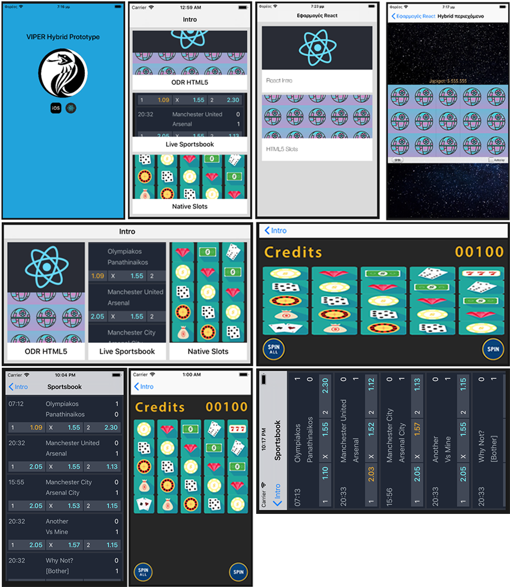
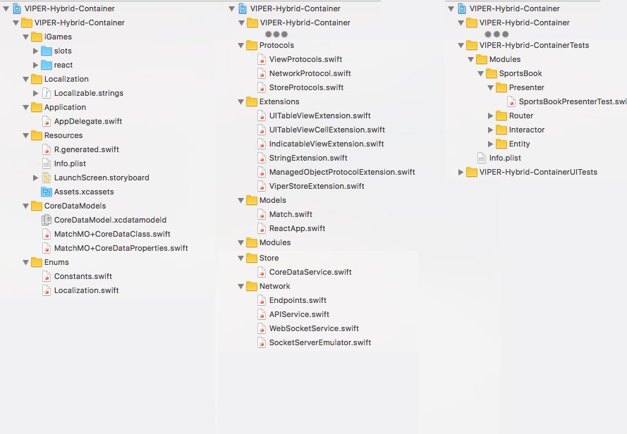

# A case study in modern iOS development



## Intro

This project started as a quick exercise / research into ODR (On Demand Delivery) for HTML5 Content using the VIPER Architecture.

Next came the addition of a second VIPER module: The Playbook.

Here a Web Service (and later on) a Generic web service is used to fetch a number of Matches from a server. As soon as the data is downloaded, they are shown in a table view and at the same time the module's Interactor (via its Presenter) starts listening on a Web Socket for match updates (a simple echo service, as we did not have access to a live web socket server).

A Socket Emulator was then added that sends messages to the echo service, emulating a server sending data.

As soon as any update arrives from the simulated server (but 'live' via the echo service), the View's table updates with only the row/rows that contain updated data.

The updated data are animated (color + label text flips) so the user knows that data have changed.

Data at the moment are not stored into disk or memory resulting in the playbook reseting after the user leaves its screen and returning to the intro screen. Later on a storage service was added (and a data manager will be added) in order to demonstrate this functionality.

At this point, testing was added to the project, specifically we test in full the PlayBook Module with 100% test coverage :)

Following this, a number of monitoring session using xCode instruments were done, resulting in a cyclic reference bug fix, and a constrains related cpu usage improvement.

As soon as we were done with the SportsBook module, a third module was added in order to investigate SpriteKit for native games development and thus SpriteKit Slots was born.

The game is fully responsive, the Slot Machine can be initialised with any number of rows and columns and depending on the given frame and initialisation parameters can even rescale its children in order to fit the available space.

At the moment when elements do not fit in the specified area, slots have their height scaled to a smaller value (and thus breaking the slot's image ratio).

In a next version, more scaling options will be added. For example another solution would be to keep the slot elements to their correct ratio and calculate the maximum width and height that can fit all slots. The Slot Machine frame will then be smaller than the given frame and a second option could be given to reposition it, for example .left, .center, .right and so on.

At this point an investigation was started into allowing the app to rotate to any orientation, but keep 2 specific views locked:

The SportsBook should only allow for portrait mode, while the Slots Game should be allowed to run in Portrait or Landscape, but disallow rotations after the view has started, as we have not yet implemented the re - scaling/positioning method required, and responsive/positional calculations are done only on initialisation.

Here we introduced SwiftLint into the project and refactored the code as per its suggestions. A couple of rules where slightly overruled and some bypassed completely as the current version of xCode on this machine its quite... old (@ v9.2) resulting in SwiftLint having issues with newlines and whitespaces that xCode auto creates. As usual more info in the SwiftLint section bellow.

At this point and in order to investigate modern usage of CoreData, a generic CoreData backed Storage service was introduced. To test its usage, the Sporkbook module now fetches its initial data from the internet only if local/cached data do not exist. If data is here, they are returned and the web call is bypassed.

For testing purposes, we empty the DataStore every time the app starts, as we had some issues with the emulator not deleting data from the app finished handler.

At this point a refactoring is needed to the module's presenter and interactor in order to update its local/stored content with updates received from the socket server. Presenter now calls updateStoredGames() every time it is notified with a new Match update.

This will change in the near future when a DataManager will be introduced which will be responsible for keeping data in sync, and remove related dependancies to the network service and the store service.

Now when users exit the SportsBook screen and then return they see the same data as the last time they opened the screen. This is not exactly the normal flow for such an app, as in a real case we should fetch new match data here, as matches could probably have been updated (at the moment we are fine for the list of cached matches as their updates will be received from the socket server).

In the following sections we are going to provide an overview of the subject, give some implementation details, and discuss some of the more interesting bits of the code / design.

Maybe re-write this readme into a series of tutorials? U+1F609

## 1.  VIPER Architecture

```
  //TODO: High Level View of the VIPER architecture
          Reference Links
          & Reference to VIPER Tutorial that the initial structure was based upon
```

## 2.  Project Structure



As you can see in the previous image, our project contains quite a elements, but
do not worry as in this section we will go through them and explain the reasons of their existence!

Some are specific to this project and will be marked so, for example the topmost directory "iGames" which holds our HTML5 content that we want to provision via ODR delivery.

The rest could become a very good starting point / skeleton project for our next VIPER based project.

### iGames

As already mentioned, this folder contains two HTML5 Apps that we will provision via ODR.

The first is a minimal ReactWeb Application which we build here locally, while the second is a slot machine implementation in HTML5 ```( //TODO: ref: bellow )```

More info will be provided in the relevant section.

### Localization

As its name suggest, this directory contains the Localizable strings of the application (an xCode feature). More info is provided in the next section.

### Application

Just the AppDelegate of our application

### Resources

The LaunchScreen Storyboard, info.plist and our main Assets.xcassets containing the icons of our app, launch screen images.

#### R.generated.swift

```
  //TODO: Description of R.swift
          Reference Links
```

### CoreDataModels

xCode's Data Model definition file and any Entity Managed objects. More info will be provided in the relevant section

### Enums

#### Constants

Our main Constants definition enum. Quite minimal at the moment:

```
enum Constants {
    enum Images {
        static let imagePlaceholder = "image-placeholder"
    }
}
```

The nested enum allows for clean and structured usage of the constants such as this:

```
    placeholder: UIImage(named: Constants.Images.imagePlaceholder)
```

as well as allowing us to extend this Constants Enum per module U+1F609 as here:

```
extension Constants {

    enum Playbook {
        enum Values {
            static let rowHeight = CGFloat(106.0)     //the match cell row height
            ...
        }

        enum Colors {
            static let screenBGColor = UIColor.init(red: 48/255, green: 53/255, blue: 64/255, alpha: 1) //darkgrey
            ...
        }
    }
}
```

### Protocols

```
//TODO: TO BE CONTINUED SORTLY...
```


## 3.  Localisation


In the

4.  On Demand Delivery (ODR)
5.  Local HTML5 Content
6.  A Generic Web Service
7.  A Web Socket Service + Local Emulator
8.  Fast TableView updates
9.  Animating TableView row elements
10.  Testing a VIPER based app
11.  Monitoring an iOS app
12.  SpriteKit Slots Game
13.  Orientation support and specific screen locking
14.  SwiftLint
15.  A Generic CoreData backed Storage Service
16.  A Generic Data Manager


Quickly became a Case Study into using Swift, SwiftLint, Testing, SpriteKit, ++

The app now contains three sections:


Including a Sportbook with live game updates:


Fully tested:


And Monitored:


As well as a full native Slot Machine game made with SpriteKit:


[More info coming really soon as an update to this file]
