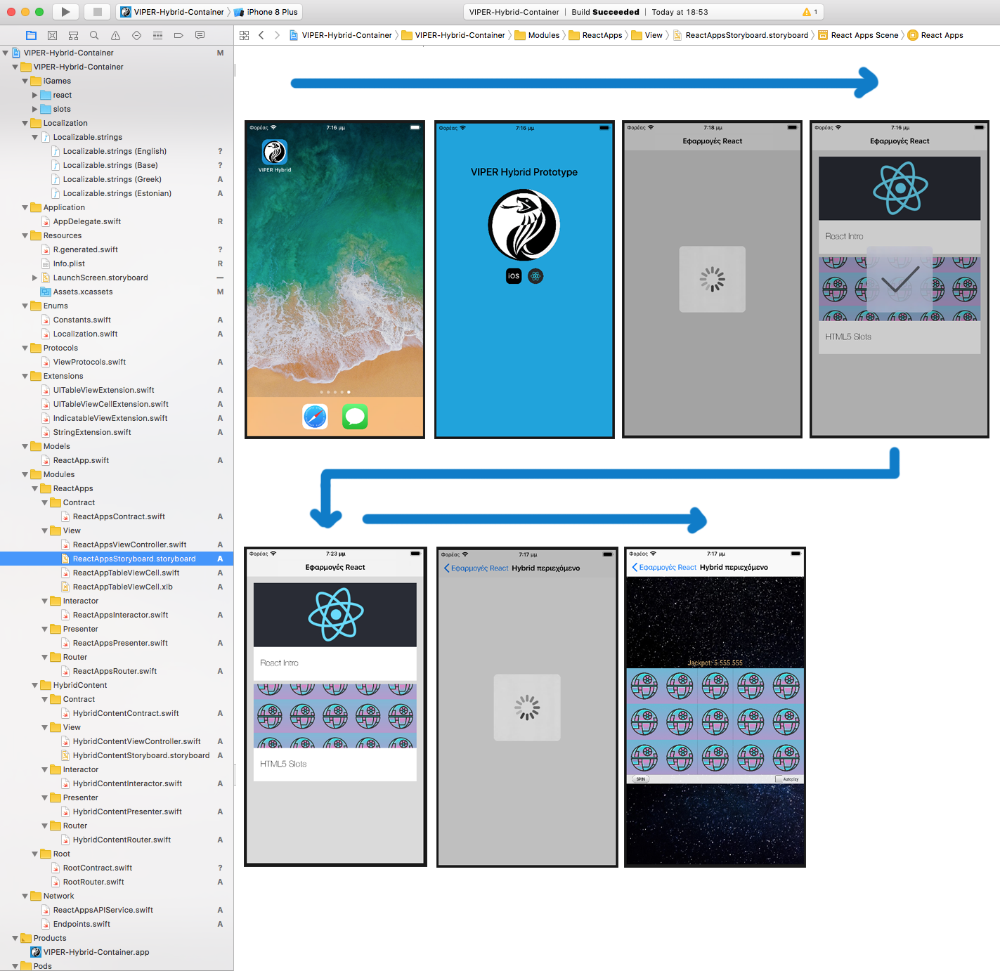
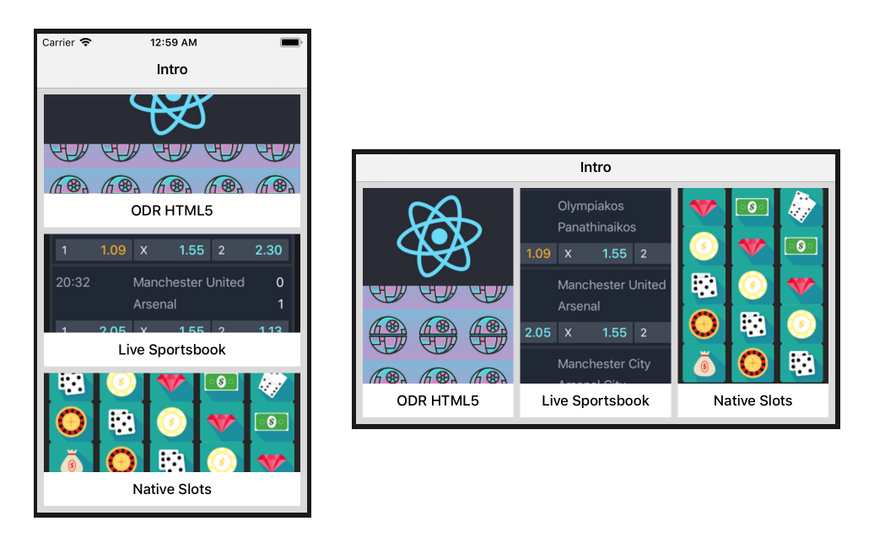
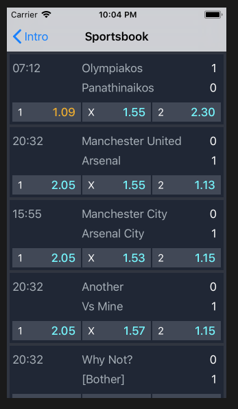
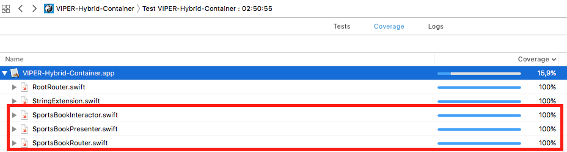
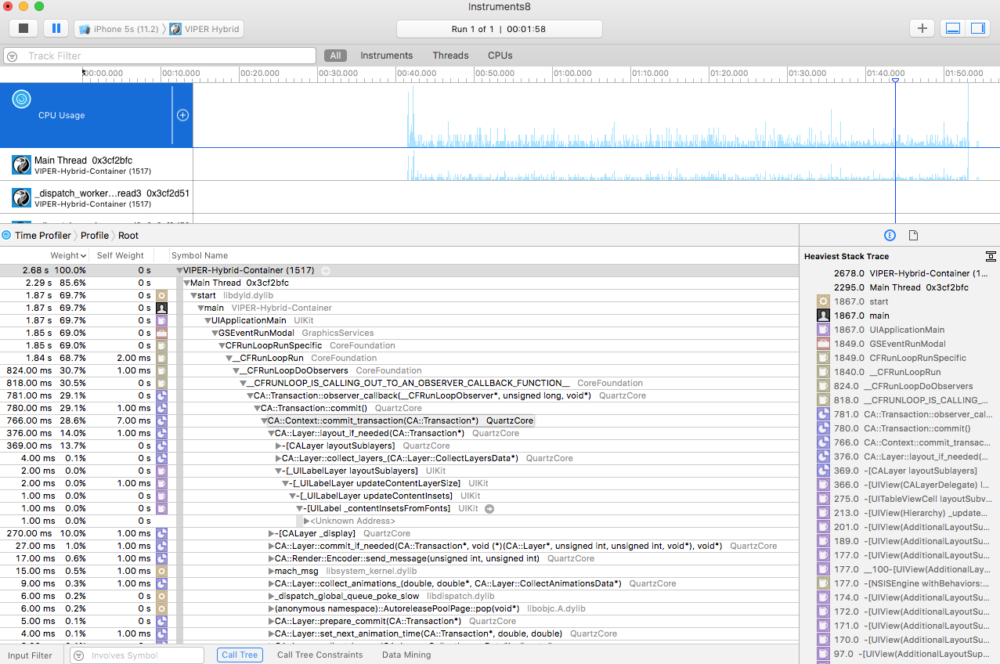
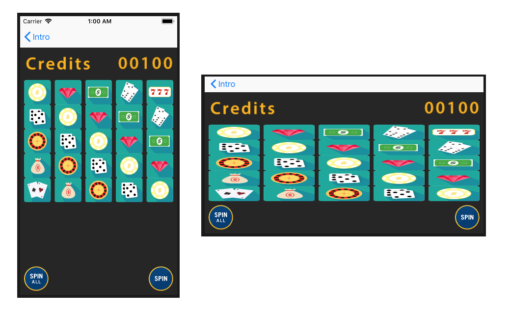

# VIPER-Hybrid-ODR-Prototype

What started as a quick exercise / research into ODR (On Demand Delivery) for HTML5 Content using the VIPER Architecture.

Quickly became a Case Study into using Swift, SwiftLint, Testing, SpriteKit, ++

The app now contains three sections: 

Including a Sportbook with live game updates:

Fully tested:

And Monitored:

As well as a full native Slot Machine game made with SpriteKit:

[More info coming really soon as an update to this file]
